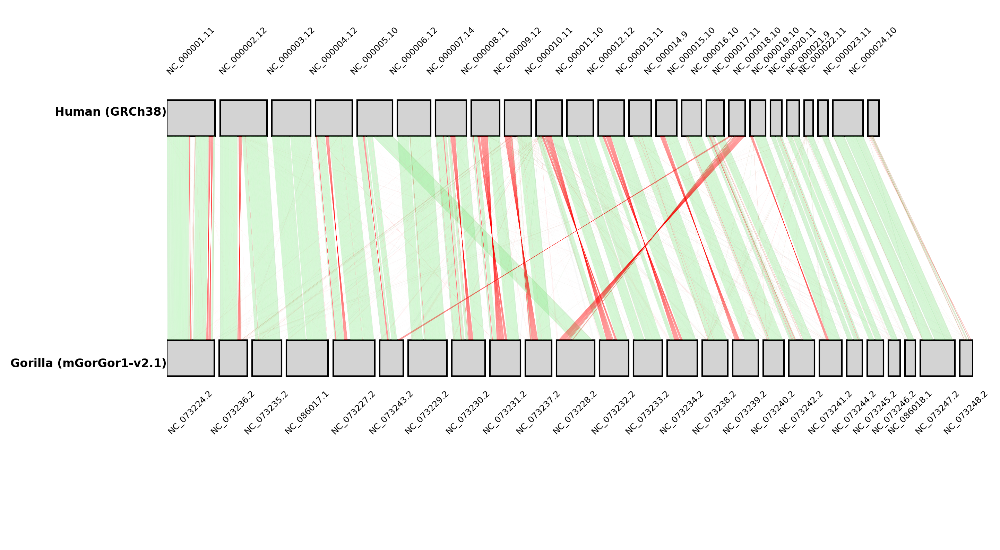
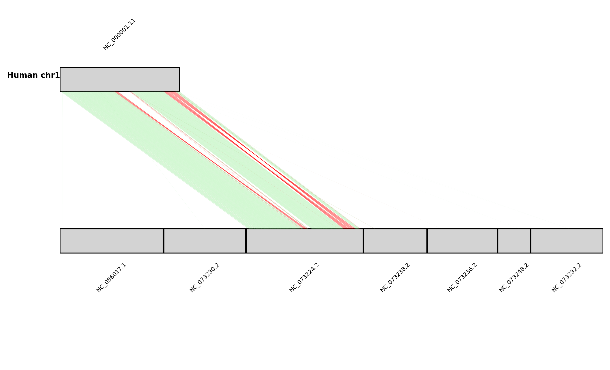
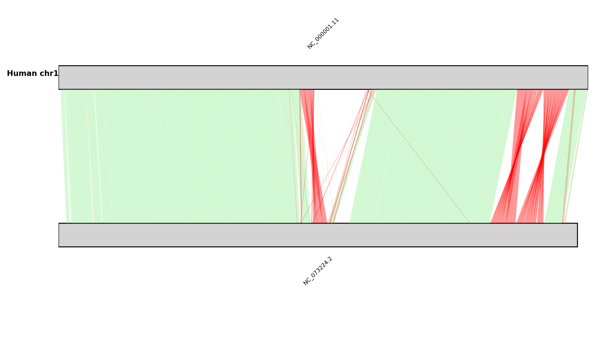

# pafkit

A collection of python scripts for processing and visualizing PAF alignment files

## Getting started

First, you'll need a working python installation (developed with 3.12.7, probably works with most 3.x versions). 

Clone the repository and install the dependencies:
```
git clone https://github.com/axeljen/pafkit.git

cd pafkit
pip install -r requirements.txt

# make the scripts executable
chmod +x *.py

```

Not needed for the scripts per se, but for generating the paf files, minimap2 is a very handy tool:
https://github.com/lh3/minimap2

and I use samtools in the examples below to index fasta files:
https://github.com/samtools/samtools


All these scripts take genome-genome alignments in paf format as input. Can be generated with minimap2, e.g.:

```
minimap2 -x asm5 -c ref.fa query.fa > alignments.paf
```

As of now, the scripts in this repo can be used to plot pairwise syntenymaps from paf files, and to subset/filter paf files. The scripts are still under development, and more functionality will be added.

## plot_paf.py

Script to vizualize whole genome alignments in paf format.

Usage:
```
usage: plot_paf.py [-h] -i INPUT -r REFERENCE -q QUERY -o OUTPUT
                   [--min-aln-length MIN_ALN_LENGTH]
                   [--min-identity MIN_IDENTITY] [--min-quality MIN_QUALITY]
                   [--min-reference-length MIN_REFERENCE_LENGTH]
                   [--min-query-length MIN_QUERY_LENGTH] [--gap-size GAP_SIZE]
                   [--chromlabs {both,ref,query,none}] [--skip-reorientation]

Plot synteny map from PAF file.

optional arguments:
  -h, --help            show this help message and exit
  -i INPUT, --input INPUT
                        Input PAF file
  -r REFERENCE, --reference REFERENCE
                        Reference genome file (one sequence name per line)
  -q QUERY, --query QUERY
                        Query genome file (one sequence name per line)
  -o OUTPUT, --output OUTPUT
                        Output image file (e.g., output.png)
  --min-aln-length MIN_ALN_LENGTH
                        Minimum alignment length to consider (default: 1000)
  --min-identity MIN_IDENTITY
                        Minimum fraction identity to consider (default: 0
                        (bound between 0-1))
  --min-quality MIN_QUALITY
                        Minimum mapping quality to consider (default: 0)
  --min-reference-length MIN_REFERENCE_LENGTH
                        Minimum reference sequence length to consider
                        (default: 0)
  --min-query-length MIN_QUERY_LENGTH
                        Minimum query sequence length to consider (default: 0)
  --gap-size GAP_SIZE   Gap size in bp between sequences in the plot (default:
                        1000000)
  --chromlabs {both,ref,query,none}
                        Show chromosome labels: both, ref, query, none
                        (default: both)
  --skip-reorientation  Skip reorienting query sequences to match reference
                        (default: False)

```

Below is a example of how to get a whole-genome synteny plot. Here I've aligned the gorilla reference genome (GCF_029281585.2) to the human reference genome (GCF_000001405.40). Both these genomes can be readily downloaded from NCBI.

```
# align the gorilla genome to the human genome with minimap2
minimap2 -x asm5 -c GCF_000001405.40_GRCh38.p14_genomic.fna GCF_029281585.2_NHGRI_mGorGor1-v2.1_pri_genomic.fna > gorilla_vs_human.paf

# simple way to get the genome files is to index with samtools faidx
samtools faidx GCF_000001405.40_GRCh38.p14_genomic.fna
samtools faidx GCF_029281585.2_NHGRI_mGorGor1-v2.1_pri_genomic.fna

# plot the alignments as a synteny map, removing scaffolds shorter than 10Mb in the reference genome, to retain only chromosome level scaffolds. Also skipping alignments shorter than 20kb.
./plot_paf.py -i gorilla_vs_human.paf \
  -r GCF_000001405.40_GRCh38.p14_genomic.fna.fai \
  -q GCF_029281585.2_NHGRI_mGorGor1-v2.1_pri_genomic.fna.fai \
  -o gorilla_vs_human.png \
  --min-reference-length 10000000 \
  --min-aln-length 20000 \
  --gap 25000000 \
  --refgenome-label "Human (GRCh38)" \
  --querygenome-label "Gorilla (mGorGor1-v2.1)"

```
If everything worked, the above command should produce a file called `gorilla_vs_human.png` that looks something like this:


## subset_paf.py

Script to subset a paf file based on specified reference or query regions.

For example, we can subset the alignment between the gorilla and human genomes to only include alignments to chromosome one in the human, and then plot that too.

```

# subset the paf file to only include alignments to chromosome 1 in the human genome
./subset_paf.py -i gorilla_vs_human.paf -r NC_000001.11 -l 20000 | \
./plot_paf.py -i - -o gorilla_to_human_chr1.png \
  -r GCF_000001405.40_GRCh38.p14_genomic.fna.fai \
  -q GCF_029281585.2_NHGRI_mGorGor1-v2.1_pri_genomic.fna.fai \
  --min-aln-length 20000 \
  --refgenome-label "Human chr1"

```

This produces the following plot:


As you'll see, this keeps a whole bunch of gorilla chromosomes that look more or less void of alignments to chromosome 1. This is because by default, the subset script keeps any scaffolds that contains any single alignment to the specified reference region. This can be fixed by playing with the --aligned-fraction X flag, which will remove query sequences that are less than X fraction aligned after subsetting. For example:

```

# subset the paf file to only include alignments to chromosome 1 in the human genome, and only keep query sequences that are at least 20% aligned after subsetting. This requires the query genome index file to be present too.
./subset_paf.py -i gorilla_vs_human.paf -r NC_000001.11 -l 20000 --aligned-fraction 0.2 --query GCF_029281585.2_NHGRI_mGorGor1-v2.1_pri_genomic.fna.fai | \
./plot_paf.py -i - -o gorilla_to_human_chr1_aln_fraction_0.2.png \
  -r GCF_000001405.40_GRCh38.p14_genomic.fna.fai \
  -q GCF_029281585.2_NHGRI_mGorGor1-v2.1_pri_genomic.fna.fai \
  --min-aln-length 20000 \
  --refgenome-label "Human chr1"

```

Which results in a much cleaner plot:
